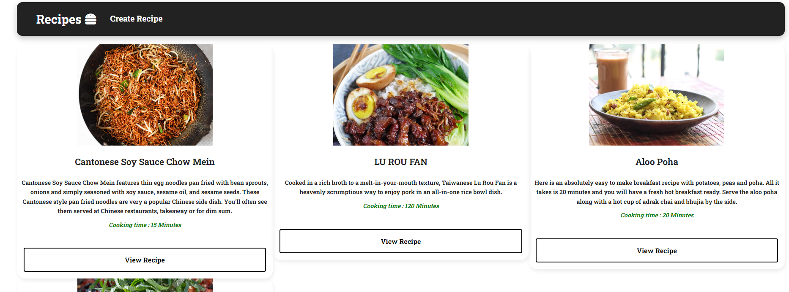
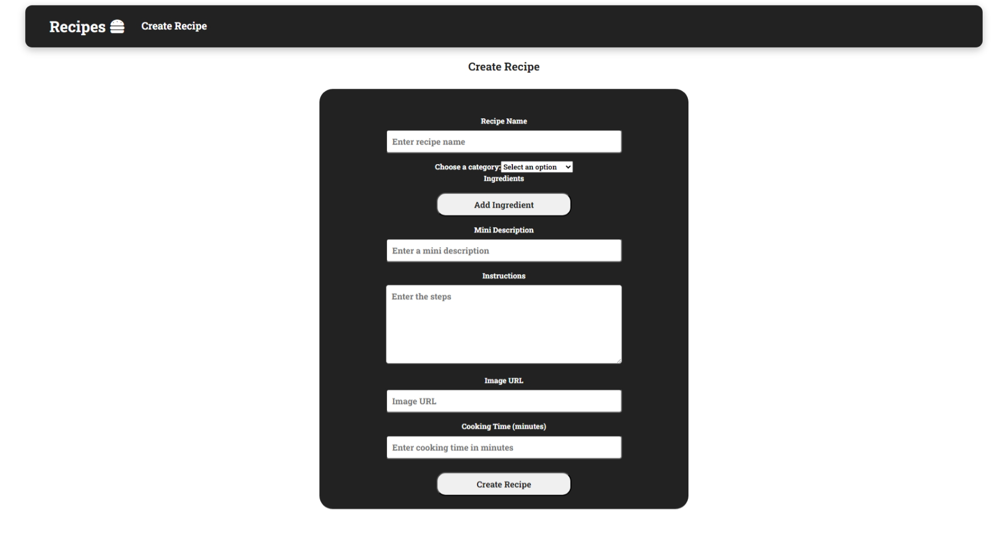
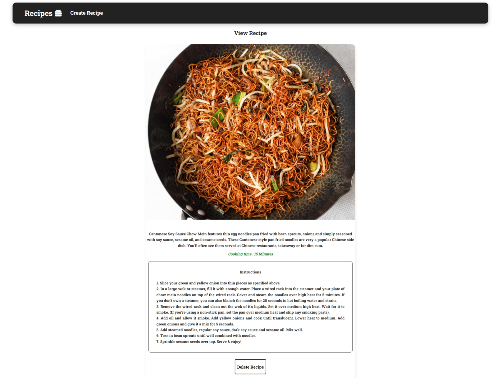

<h1 align="center" style="font-weight: bold;">Project name 💻</h1>

<p align="center">
 <a href="#tech">Technologies</a> • 
 <a href="#started">Getting Started</a> • 
  <a href="#colab">Collaborators</a> •
 <a href="#contribute">Contribute</a>
</p>

<p align="center">
    <b>Simple description of what your project do or how to use it</b>
</p>


<h2 id="layout">🎨 Layout</h2>

<div style="display: flex; align-items: center; justify-content: space-around">
  
  
</div>

<h2 id="technologies">💻 Technologies</h2>

- HTML
- CSS
- Javascript
- React
- Node
<h2 id="started">🚀 Getting started</h2>

<h3>Prerequisites</h3>

- NodeJS and NPM

Check if your system has [NPM and NodeJS](https://www.geeksforgeeks.org/how-to-download-and-install-node-js-and-npm/) and installed using the following command.
```bash
node -v
npm -v
```
<h3>Setting up project</h3>

Clone the repository and move into the client folder using the following commands: 
```bash
git clone https://github.com/ShivangDholaria/Recipe-App.git
cd ./Recipe-App/client
```

Run the following command to start the project locally:

```bash
 npm install 
 npm start
```

Make sure that the backend is up and running before starting the frontend as it might not work appropriately. 

Once the project is up and running you should be able to see the following on screen:


This is the homepage of the application and you can add and view recipes from here.

<h4>Adding New Recipes</h4>

You can click on `Create Recipe` to add a new recipe in the application. A new page will open up where you can add all the necessary information about your recipe and save it in the application.


<h4>Viewing Recipes</h4>

You can click on `View Recipe` to get more details on how to cook it. And it also provides an option to delete the recipe if you want to remove it completely.


